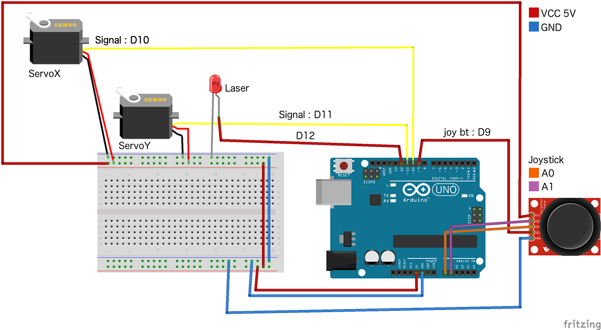

# CATBOT

## TL;DR

to use the cat bot you need to require it ... 

```javascript
var catbot = require('catbot');

// callback function that will be called when the board is ready
function catCb (error, hardware) {
	/*
	Board is ready, use your robot:
	hardware = {
	    board  : Board
	  , x      : Servo
	  , y      : Servo
	  , laser  : Led
	  , to    : Function
	}
	*/
	hardware.laser.on() // set the laser on
} 

const opts = {
  hwJoystick: true // this enable the harware joystick
}

catbot(catCb, opts) // catCb will be ran when the board is ready
```

## Use it

### instantiate the bot
see the code above.

### inside the bot :
move the X axis servo to 30° ```hardware.x.to(30)``` same goes for Y

- switch the laser on  ```hardware.laser.on()``` see j5 docs for [servo][1]
- toggle the laser ```hardware.laser.toggle()``` see j5 docs for [led][2]
- joystick  events ```harware.joystick.on('change', function () {...})``` see j5 docs for [joysticks][3]
- move both servo ```hardware.to([90, 90])``` 

note on the 'to' method: this method is using inputRange and servoRange to scale value, see the detailed option for example

## default Configuration

### Pins
default config for the pins, wire your device as follow :

- servoX : pin 10
- servoY : pin 11
- laser : pin 12
- joystick
	- x axis : A0
	- y axis : A1
	- bt : pin 9

here is a diagram of the cat wiring



the led with in the schematic is the laser, my Fritzing did not have a laser module.

## Options

the second argument of the catbot function is an option oject, here are the default and explanation of the settings, this object if optional, and you just need to add the value you want to override

```
{
	hwJoystick: false // this enable/disable creation and pooling of the the harware analogue joystick
	catConfig: {
		"inputRange": [0, 180],
		"servoRange": [10, 170],
		"hwJstk": false,
		"hw": {
			"laser": {
				"pin": 12
			},
			"servoX": {
				"pin": 10,
				"inverted": true
			},
			"servoY": {
				"pin": 11,
				"inverted": true
			},
			"jstk": {
				"x": "A0",
				"y": "A1",
				"jBt": 9,
				"isPullup": true,
				"deadZone": 0.05
			}
		}
	}
}
```

### inputRange, servoRange

these are two arrays of 2 numbers reprsenting the min-max scale the catbot will match.

example, gamepax axes are usually from a range -1 to 1 with 0 as a center, while servos take a number between 0 and 180 representing the degree. in this case

```
...
	inputRange: [-1, 1]
	servoRange: [0, 180]
... 
```

will map the gamepad axes to the coresponding angle

#### hwJoystick
enable or disable listening for the analog joystick, note that this will produce event that will move the turret, so you won't be able to controll it on joystick mode.

#### hw: hardware
pin and option configuration for the catbot harware contain the following options

#### laser
pin : the pin the laser is attached to (default: 12)

#### servoX, servoY
- pin : the pin the servo is attached to (default: 10, 11)
- inverted: is the axis inverted (default: true)

#### jstk
- x: pin for the X axis (default: A0)
- y: pin for the Y axis (default: A1)
- jBt: pin for the joystick button (default: 9)
- isPullup: does the button need a pullup resistor (set internaly) to filter noise (default: true)
- deadZone: apply a deadzone on the joy input to avoid noize from joy calibration (default: 0.05)

[1]: http://johnny-five.io/api/servo/
[2]: http://johnny-five.io/api/led/
[3]: http://johnny-five.io/api/joystick/
